# PINGWINS Data Lineage Diagram

This document visualizes the complete data lineage of the PINGWINS platform, showing how data flows from sources through transformations to destinations.

```mermaid
graph TB
    %% Data Sources
    subgraph Sources["📱 Data Sources"]
        Sticker["Smart Sticker<br/>(NFC/BLE)"]
        UserInput["User Input<br/>(Phone, Name, Email)"]
        Device["Device Identity<br/>(IMEI/Platform)"]
        OTP["OTP Code<br/>(6-digit)"]
    end

    %% Frontend Layer
    subgraph Frontend["🎨 Frontend Layer"]
        Splash["Splash Screen<br/>(index.tsx)"]
        Welcome["Welcome Screen<br/>(welcome.tsx)"]
        CreateAccount["Create Account<br/>(create-account.tsx)"]
        VerifyPhone["Verify Phone<br/>(verify-phone.tsx)"]
        Success["Success Screen<br/>(success.tsx)"]
        
        HomeTab["Home Tab<br/>(home.tsx)"]
        WinspayTab["WINSPAY Tab<br/>(winspay.tsx)"]
        StickersTab["Stickers Tab<br/>(stickers.tsx)"]
        ActivityTab["Activity Tab<br/>(activity.tsx)"]
        
        Store["Zustand Store<br/>(useStore.ts)"]
        DeviceUtils["Device Utils<br/>(deviceIdentity.ts)"]
        Tokens["Design Tokens<br/>(tokens.ts)"]
    end

    %% Data Transformations
    subgraph Transformations["⚙️ Data Transformations"]
        PhoneFormat["Phone Formatting<br/>(formatPhoneNumber)"]
        PWIDExtract["PWID Extraction<br/>(from NFC/BLE)"]
        DeviceAbstraction["Device Identity<br/>Abstraction"]
        OTPValidation["OTP Validation<br/>(6-digit check)"]
        StateUpdate["State Updates<br/>(setUser, completeOnboarding)"]
    end

    %% Backend Layer
    subgraph Backend["🔧 Backend API"]
        RegisterAPI["POST /register-sticker<br/>(Bind PWID to IMEI)"]
        VerifyAPI["GET /verify<br/>(Verify Authenticity)"]
        WinspaySend["POST /winspay/send<br/>(Send Payment)"]
        WinspayHistory["GET /winspay/history<br/>(Transaction History)"]
        ObjectLookup["GET /object/lookup<br/>(Future Vertical Search)"]
    end

    %% Database Layer
    subgraph Database["💾 PostgreSQL Database"]
        UsersTable["users<br/>(id, name, email, phone, created_at)"]
        StickersTable["stickers<br/>(id, pwid, ble_uuid, nfc_uid, status)"]
        OwnershipTable["ownership<br/>(id, pwid, user_id, imei, locked_at)"]
        WinspayWallets["winspay_wallets<br/>(id, user_id, wallet_address, status)"]
        TransactionsTable["transactions<br/>(id, sender_id, receiver_id, pwid, amount)"]
        GeoEventsTable["geo_events<br/>(id, pwid, geom, timestamp)"]
    end

    %% Data Destinations
    subgraph Destinations["📊 Data Destinations"]
        UIComponents["UI Components<br/>(Cards, Buttons, Inputs)"]
        DisplayData["Display Data<br/>(User Info, Stats, History)"]
        PaymentSystem["WINSPAY System<br/>(Device-locked Payments)"]
        VerificationSystem["Verification System<br/>(Sticker Authentication)"]
    end

    %% Flow: Sticker Registration
    Sticker -->|NFC/BLE Scan| PWIDExtract
    PWIDExtract -->|PWID| HomeTab
    HomeTab -->|Scan Action| RegisterAPI
    
    %% Flow: User Onboarding
    UserInput -->|Phone Number| CreateAccount
    CreateAccount -->|Phone Input| PhoneFormat
    PhoneFormat -->|Formatted Phone| CreateAccount
    CreateAccount -->|setUser| Store
    Store -->|User Data| VerifyPhone
    VerifyPhone -->|OTP Input| OTPValidation
    OTPValidation -->|Valid OTP| StateUpdate
    StateUpdate -->|completeOnboarding| Store
    Store -->|Auth State| HomeTab
    
    %% Flow: Device Identity
    Device -->|Platform Info| DeviceUtils
    DeviceUtils -->|Device Identity| DeviceAbstraction
    DeviceAbstraction -->|IMEI/Platform| RegisterAPI
    
    %% Flow: Registration to Database
    RegisterAPI -->|User + PWID + IMEI| UsersTable
    RegisterAPI -->|PWID + BLE/NFC| StickersTable
    RegisterAPI -->|PWID + User + IMEI| OwnershipTable
    
    %% Flow: WINSPAY
    WinspayTab -->|Payment Init| WinspaySend
    WinspaySend -->|IMEI Validation| OwnershipTable
    WinspaySend -->|Transaction| TransactionsTable
    WinspaySend -->|Wallet Update| WinspayWallets
    WinspayHistory -->|Query| TransactionsTable
    TransactionsTable -->|History Data| ActivityTab
    
    %% Flow: Verification
    HomeTab -->|Verify Action| VerifyAPI
    VerifyAPI -->|Query| StickersTable
    VerifyAPI -->|Query| OwnershipTable
    VerifyAPI -->|Result| HomeTab
    
    %% Flow: Display Data
    Store -->|User State| HomeTab
    Store -->|User State| WinspayTab
    UsersTable -->|User Info| DisplayData
    StickersTable -->|Sticker List| StickersTab
    TransactionsTable -->|Activity| ActivityTab
    DisplayData -->|Rendered| UIComponents
    
    %% Flow: Design Tokens
    Tokens -->|Colors, Spacing, Typography| UIComponents
    Tokens -->|Theme| HomeTab
    Tokens -->|Theme| WinspayTab
    Tokens -->|Theme| StickersTab
    Tokens -->|Theme| ActivityTab
    
    %% Flow: Navigation
    Splash -->|Check Auth| Store
    Store -->|hasCompletedOnboarding| Welcome
    Store -->|isAuthenticated| HomeTab
    Welcome -->|Get Started| CreateAccount
    CreateAccount -->|Continue| VerifyPhone
    VerifyPhone -->|Success| Success
    Success -->|Navigate| HomeTab
    
    %% Flow: Future Verticals
    ObjectLookup -->|Query| StickersTable
    ObjectLookup -->|Query| OwnershipTable
    ObjectLookup -->|Query| GeoEventsTable
    
    %% Styling
    classDef sourceStyle fill:#e1f5ff,stroke:#01579b,stroke-width:2px
    classDef frontendStyle fill:#f3e5f5,stroke:#4a148c,stroke-width:2px
    classDef transformStyle fill:#fff3e0,stroke:#e65100,stroke-width:2px
    classDef backendStyle fill:#e8f5e9,stroke:#1b5e20,stroke-width:2px
    classDef dbStyle fill:#fce4ec,stroke:#880e4f,stroke-width:2px
    classDef destStyle fill:#e0f2f1,stroke:#004d40,stroke-width:2px
    
    class Sticker,UserInput,Device,OTP sourceStyle
    class Splash,Welcome,CreateAccount,VerifyPhone,Success,HomeTab,WinspayTab,StickersTab,ActivityTab,Store,DeviceUtils,Tokens frontendStyle
    class PhoneFormat,PWIDExtract,DeviceAbstraction,OTPValidation,StateUpdate transformStyle
    class RegisterAPI,VerifyAPI,WinspaySend,WinspayHistory,ObjectLookup backendStyle
    class UsersTable,StickersTable,OwnershipTable,WinspayWallets,TransactionsTable,GeoEventsTable dbStyle
    class UIComponents,DisplayData,PaymentSystem,VerificationSystem destStyle
```

## Data Flow Summary

### 1. **Onboarding Flow**
- User enters phone number → Formatted → Stored in Zustand → Used for OTP verification → Onboarding completed → State updated

### 2. **Sticker Registration Flow**
- Smart Sticker (NFC/BLE) → PWID extracted → Combined with user data and IMEI → Sent to backend → Stored in database (stickers, ownership, users tables)

### 3. **WINSPAY Payment Flow**
- Payment initiated → IMEI validated against ownership table → Transaction created → Wallet updated → History displayed

### 4. **Verification Flow**
- Sticker scanned → PWID retrieved → Backend verifies against database → Result displayed to user

### 5. **Data Persistence**
- All critical data flows through PostgreSQL database
- State management (Zustand) handles in-memory UI state
- Design tokens provide consistent styling across components

## Key Data Entities

- **PWID**: Immutable root identity for all verticals
- **IMEI**: Device identifier that locks PWID to device
- **User Data**: Phone, name, email stored in users table
- **Ownership**: Links PWID to user and IMEI (non-transferable)
- **Transactions**: WINSPAY payment records
- **Geo Events**: Location tracking for stickers (PostGIS)

